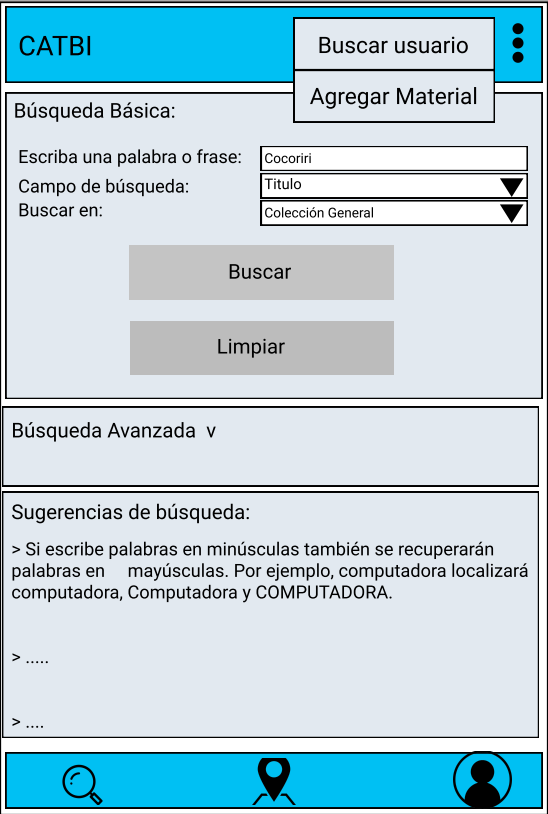
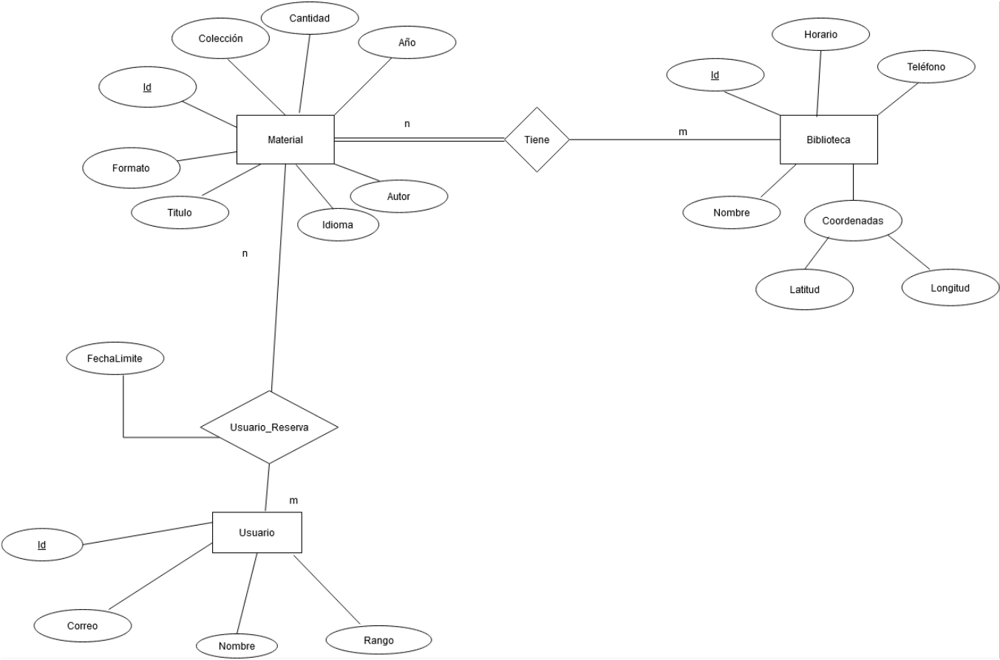

# Universidad de Costa Rica

## Conceptualización Sprint 3

## Catálogo de Bibliotecas UCR (CATBI)

## Versión 1.2

---

## Introducción
Este documento presenta una descripción general de la aplicación móvil a desarrollar para el catálogo del sistema de bibliotecas de la Universidad de Costa Rica.  
En el siguiente link se encuentra el catálogo en su versión web: http://aleph.sibdi.ucr.ac.cr/F. 
Por otra parte se exponen aspectos visuales de la aplicación mediante prototipos para tener una idea clara de cómo se podría ver la aplicación al finalizar el primer sprint. 
Además se especifican aspectos técnicos como el diseño de la base de datos, frameworks a utilizar, herramientas y estrategias de versionamiento.

## Listado de Equipos y miembros de Equipos
Equipo Nesquick:

* Josué Valverde Sánchez B16802
* Iván Chavarría Vega B72097
* Gerald Bermúdez Ramírez B71078
* Sebastián Otárola Sánchez B75612

## Descripción general del sistema a desarrollar

* **Contexto, situación actual, y problema a resolver**
El catálogo del sistema de bibliotecas de la Universidad de Costa Rica es sumamente utilizado por estudiantes, administrativos y profesores para realizar consultas sobre materiales disponibles en las distintas bibliotecas de la universidad.
Al día de hoy este catálogo tiene una página web en donde se realizan las consultas de todo tipo de materiales para cualquier biblioteca. Sin embargo, esta página tiene ciertas limitaciones, sobre todo cuando se accede desde dispositivos móviles, que complican el proceso de consulta para los usuarios. Por ejemplo, al ingresar mediante cualquier dispositivo móvil el contenido de la página es difícil de visualizar, los campos de búsqueda son pequeños, al igual que los botones y en ocasiones el proceso de consulta puede ser confuso.

- **Solución Propuesta**
Por la problemática antes mencionada se propone realizar una aplicación móvil para dispositivos android que permite realizar funciones similares a la página web del catálogo del sistema de bibliotecas de la UCR pero de una manera más amigable para el usuario y con una mejor visualización en el dispositivo móvil. La aplicación va a tener como funcionalidad principal la consulta de materiales que estén dentro del catálogo permitiendo realizar distintas búsquedas con distintos parámetros. También, como funcionalidades secundarias la aplicación va a tener información básica de cada una de las bibliotecas de la Universidad, va a permitir a los usuarios realizar trámites relacionados con los materiales y , además, va a permitir la inclusión de material para enriquecer el catálogo. 

* **Descripción de los principales epics asociados a los temas a desarrollar. Descripción de interacción entre estos epics.**

    * **Epic 1: Buscador Básico.** Es el buscador que deberia   de aparecerle al usuario en la pantalla principal de la aplicación para que busque el material del catálogo de biblioteca deseado. Esta búsqueda se realizaría por: palabra clave, colecciones  y campo de búsqueda.

    * **Epic 2: Buscador Avanzado.** La busqueda a su vez, se puede realizar por medio de distintos filtros predefinidos. Estos filtros son: idioma, fecha, autor, biblioteca y tipo de material.

    * **Epic 3: Información general Bibliotecas.** La aplicacion permite obtener la localización de las distintas bibliotecas en un mapa e información básica de esta. Esto el fin de tener conocimiento del lugar en donde está el material, horas de atención de la misma y teléfono de contacto. Esto desde los resultados de la busqueda de material o desde un listado general de bibliotecas.
     
    * **Epic 4: Administración Material.** La aplicación tambien permitirá que usuarios autorizados puedan manejar archivos de la base de datos (subir nuevos, eliminar existentes, etc). 
    
    * **Epic 5: Reservación Material.** Se permitirá que usuarios puedan seleccionar un materíal y reservarlo en la biblioteca que corresponda para que luego pueda pasar a retirarlo sin el problema de que alguien más lo haya hecho.
    
    
* **Requerimientos funcionales**

| Sprint 2 |   |
| -------- |----------------|
| Codigo   |   Nombre  |
| CNQ-71    |            [Agregar material](http://10.1.4.22:8080/browse/CNQ-71)|
| CNQ-72    |          [Modificación de material](http://10.1.4.22:8080/browse/CNQ-72)          |
| CNQ-73    |         [Eliminación de material](http://10.1.4.22:8080/browse/CNQ-73)         |
| CNQ-79    |            [Notificación límite de reserva](http://10.1.4.22:8080/browse/CNQ-79) |
| CNQ-80    | [Corrección pantalla de reservas](http://10.1.4.22:8080/browse/CNQ-80) |

 

* **Requerimientos no funcionales que debe cumplir toda la aplicación web**
    * Api de Google Maps
    * Firebase
* **Posibles interacciones con sistemas externos (bases de datos, APIs, servicios)**
Interacción con base de datos para consultas sobre material de las bibliotecas e interacción con la API de Google Maps para ubicación de las distintas bibliotecas.

## Prototipos de la aplicación

## Artefactos de bases de datos
* Esquema conceptual de la base de datos

* Cualquier otro artefacto de la base de datos que consideren necesario
* Mapeo de la base de datos

* Estado actual de la base de datos

 

## Decisiones Técnicas
* **Metodologías utilizadas y procesos definidos**
    * Metodología Utilizada: SCRUM
    * Técnica para estimación: Planning Poker con escala Fibonacci.
    * Reuniones: Lunes y Jueves después de la clase de Móviles y el sábado en la tarde.
    * Medios de comunicación: Discord y Whatsapp.
* **Artefactos utilizados**
    * Backlog que está en JIRA.
    * Documento de Conceptualización.
* **Tecnologías con sus respectivas versiones**
    * Entorno de desarrollo: Android Studio.
    * Versión del SDK: API 21 Android 5.0 Lollipop.
    * API de Google versión 17.0.
    * Firebase para base de datos en tiempo real. Versión utilizada en android 17.0.
* **Repositorio de código y estrategia de branches**
    * Link al Repositorio: https://bitbucket.org/lyonv/ecci_ci0161_ii2020_g01_t03.git/src
    * Al clonar el proyecto para correrlo se debe abrir la carpeta src.
    * Estrategia de branches: La estrategia que se va a utilizar es la de trabajar por módulos y funcionalidades, donde habría una rama de módulo que representa un subgrupo grande de la aplicación, que para nuestro caso va a representar una épica, y a su vez este módulo generaría más ramas, las cuales representan funcionalidades ya más específicas que se van a desarrollar y que pueden ser desarrolladas por un solo desarrollador usualmente. Además se utilizaría la rama master para solo tener versiones estables del proyecto.
    * Para esta iteración las ramas módulo son:
         * TBD 
         * TBD 
    * Las de funcionalidad son:
         * TBD
         * TBD
         * TBD
    * Estrategia de merge: Estando en una rama de funcionalidad sería primero asegurarse que no hay ningún cambio haciendo pull. Después hacer merge de la rama módulo a la rama de funcionalidad, resolver los conflictos si se presentaran y después hacer merge de la rama de funcionalidad a la rama de módulo. El mismo proceso se haría para hacer merge de la rama módulo a la rama master.

* **Definición de listo**
    Para que una historia se considere como lista tiene que estar en master, ser validada por los miembros del equipo y cumplir con los siguientes criterios de aceptación correspondientes a cada una de las historias de usuario:
    * CNQ-71 Agregar material: 
    * CNQ-72 Modificación de material: 
    * CNQ-73 Eliminación de material: 
    * CNQ-79 Notificación límite de reserva: 
    * CNQ-80 Corrección pantalla de reservas: