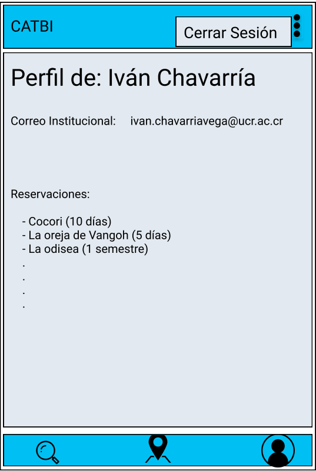
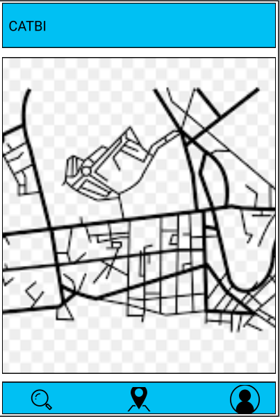

# Universidad de Costa Rica

## Conceptualización Sprint 4

## Catálogo de Bibliotecas UCR (CATBI)

## Versión 1.4

---

## Introducción
Este documento presenta una descripción general de la aplicación móvil a desarrollar para el catálogo del sistema de bibliotecas de la Universidad de Costa Rica.  
En el siguiente link se encuentra el catálogo en su versión web: http://aleph.sibdi.ucr.ac.cr/F. 
Por otra parte se exponen aspectos visuales de la aplicación mediante prototipos para tener una idea clara de cómo se podría ver la aplicación al finalizar cada uno de los sprints. 
Además se especifican aspectos técnicos como el diseño de la base de datos, frameworks a utilizar, herramientas y estrategias de versionamiento.

## Listado de Equipos y miembros de Equipos
Equipo Nesquick:

* Josué Valverde Sánchez B16802
* Iván Chavarría Vega B72097
* Gerald Bermúdez Ramírez B71078
* Sebastián Otárola Sánchez B75612

## Descripción general del sistema a desarrollar

* **Contexto, situación actual, y problema a resolver**
El catálogo del sistema de bibliotecas de la Universidad de Costa Rica es sumamente utilizado por estudiantes, administrativos y profesores para realizar consultas sobre materiales disponibles en las distintas bibliotecas de la universidad.
Al día de hoy este catálogo tiene una página web en donde se realizan las consultas de todo tipo de materiales para cualquier biblioteca. Sin embargo, esta página tiene ciertas limitaciones, sobre todo cuando se accede desde dispositivos móviles, que complican el proceso de consulta para los usuarios. Por ejemplo, al ingresar mediante cualquier dispositivo móvil el contenido de la página es difícil de visualizar, los campos de búsqueda son pequeños, al igual que los botones y en ocasiones el proceso de consulta puede ser confuso.

- **Solución Propuesta**
Por la problemática antes mencionada se propone realizar una aplicación móvil para dispositivos android que permite realizar funciones similares a la página web del catálogo del sistema de bibliotecas de la UCR pero de una manera más amigable para el usuario y con una mejor visualización en el dispositivo móvil. La aplicación va a tener como funcionalidad principal la consulta de materiales que estén dentro del catálogo permitiendo realizar distintas búsquedas con distintos parámetros. También, como funcionalidades secundarias la aplicación va a tener información básica de cada una de las bibliotecas de la Universidad, va a permitir a los usuarios realizar trámites relacionados con los materiales y , además, va a permitir la inclusión de material para enriquecer el catálogo. 

* **Descripción de los principales epics asociados a los temas a desarrollar. Descripción de interacción entre estos epics.**

    * **Epic 1: Buscador Básico.** Es el buscador que deberia   de aparecerle al usuario en la pantalla principal de la aplicación para que busque el material del catálogo de biblioteca deseado. Esta búsqueda se realizaría por: palabra clave, colecciones  y campo de búsqueda.

    * **Epic 2: Buscador Avanzado.** La busqueda a su vez, se puede realizar por medio de distintos filtros predefinidos. Estos filtros son: idioma, fecha, autor, biblioteca y tipo de material.

    * **Epic 3: Información general Bibliotecas.** La aplicacion permite obtener la localización de las distintas bibliotecas en un mapa e información básica de esta. Esto el fin de tener conocimiento del lugar en donde está el material, horas de atención de la misma y teléfono de contacto. Esto desde los resultados de la busqueda de material o desde un listado general de bibliotecas.
     
    * **Epic 4: Administración Material.** La aplicación tambien permitirá que usuarios autorizados puedan manejar archivos de la base de datos (subir nuevos, eliminar existentes, etc). 
    
    * **Epic 5: Reservación Material.** Se permitirá que usuarios puedan seleccionar un materíal y reservarlo en la biblioteca que corresponda para que luego pueda pasar a retirarlo sin el problema de que alguien más lo haya hecho.
    
    
* **Requerimientos funcionales**

| Sprint 3 |   |
| -------- |----------------|
| Codigo   |   Nombre  |
| CNQ-79    |            [Notificación Límite de reserva](http://10.1.4.22:8080/browse/CNQ-79)|
| CNQ-70    |          [Diferenciar usuarios administradores de usuarios normales](http://10.1.4.22:8080/browse/CNQ-70)          |
| CNQ-114    |         [Cerrar sesión en la aplicación](http://10.1.4.22:8080/browse/CNQ-114)         |
| CNQ-115    |            [Eliminar reservaciones](http://10.1.4.22:8080/browse/CNQ-115) |
| CNQ-116    | [Recordar el inicio sesión.](http://10.1.4.22:8080/browse/CNQ-11) |

 

* **Requerimientos no funcionales que debe cumplir toda la aplicación web**
    * Api de Google Maps
    * Firebase
    * Room
* **Posibles interacciones con sistemas externos (bases de datos, APIs, servicios)**
Interacción con base de datos para consultas sobre material de las bibliotecas e interacción con la API de Google Maps para ubicación de las distintas bibliotecas.

## Prototipos de la aplicación

## Artefactos de bases de datos
* Esquema conceptual de la base de datos

* Cualquier otro artefacto de la base de datos que consideren necesario
* Mapeo de la base de datos

* Estado actual de la base de datos

 
## Casos de prueba
### Caso 1

|                      |     |
| -------------------- | --- |
| Nombre del Epic      | Administración Material |
| Id de la Historia    | CNQ - 71  Agregar Material |
| Id de caso de prueba |    0 |
| Descripción |    Agregar un material a la base de datos de la aplicación |
| Versión |   1.0  |
| Implementado? | Sí, este caso de prueba se encuentra implementado en la clase de prueba AgregarMatTest en la rama master del repositorio. |
| Nivel |   Sistema  |
| Tipo |   Caja Negra  |
|Pre-requisitos|Debe estar conectado a internet por Wifi|
| Datos de prueba|Titulo: Drácula. Autores: Bram Stoker. Colección: Literaria. Tipo de material:Libro. Biblioteca: Carlos Monge.   Cantidad: 2   Año: 2019|
| Escenario esperado | Se despliega ventana de retroalimentación indicando que se ha agregado material y se almacena en la base de datos, se realiza una redirección a la actividad principal, para buscar el material agregado y corroborar que está presente.|

### Pasos a seguir

| #   | Instrucción | Resultado Esperado |
| --- | ----------- | ------------------ |
|   1  |        Dirigirse al menú de agregar material  y presionarlo.     |        Se redirige a la actividad de agregar material. En donde se despliega un formulario.            |
|   2 |       Rellenar el campo de título escribiendo Drácula, rellenar el campo de autores escribiendo Bram Stoker, seleccionar la opción literaria en el campo de coleccion,rellenar el campo de cantidad con 2,rellenar el campo año con 2019, en el campo de tipo de material escribir pdf y en el campo de biblioteca seleccionar Monge.      |                 Se muestran los campos del formulario con la información ingresada.|
|   4  |           Presionar el botón de agregar material  |             Se muestra una ventana emergente indicando que se ha agregado el material exitosamente y se guarda en la base de datos |
|   5 |   Se escribe el título en el área de búsqueda y se determina que el material está en la lista de resultados. |Que el material se encuentre en la lista.

### Caso 2

|  |       |
| -------- | ----------- |
|Nombre del Epic|Administración Material|
|ID de la historia|CNQ 72 Modificación Material|
|ID del caso de prueba|1|
|Descripción|Modificar un material dentro de la aplicación|
|Versión|1.0|
|Implementado?|Sí, este caso de prueba se encuentra implementado en la clase de prueba EditarMatTest en la rama master del repositorio.|
|Nivel|Sistema|
|Tipo|Caja Negra|
|Pre-requisitos| Debe estar conectado a internet por Wifi La aplicación se inicia en la actividad de detalles de un material |
|Datos de prueba|Búsqueda: Don Quijote. Modificación de la colección literaria a General.|
|Escenario esperado|Aparece un mensaje indicando que el material se ha modificado exitosamente.|

### Pasos a seguir

|#|Instrucción|Resultado esperado|
|--------|-----|---|
|1|Realizar una búsqueda del material que se desea modificar en este caso Don Quijote. |Se despliega una lista con los resultados de la búsqueda.|
|2|Seleccionar el material que se desea modificar|Se despliega una pantalla de detalles con la información del material|
|3|Presionar los tres puntos ubicados en la esquina superior derecha y seleccionar la opción editar.|Se despliega una pantalla que indica si se desea modificar el material.|
|5|Seleccionar el campo de colección y cambiar la colección a General|Se muestra el campo con la información modificada.|
|6|Presionar el botón de guardar.|Se muestra un mensaje indicando que se ha modificado exitosamente el material y se guarda el cambio en la base de datos.|

### Caso 3

|  |       |
| -------- | ----------- |
|Nombre del Epic|Administración Material|
|ID de la historia|CNQ 73 Eliminación Material|
|ID del caso de prueba|2|
|Descripción|Eliminar un material dentro de la aplicación|
|Versión|1.0|
|Implementado|Sí, este caso de prueba se encuentra implementado en la clase de prueba EliminarMatTest en la rama master del repositorio.|
|Nivel|Sistema|
|Tipo|Caja Negra|
|Pre-requisitos| Debe estar conectado a internet por Wifi El material debe de existir en la aplicación.|
|Datos de prueba|Búsqueda: Drácula.|
|Escenario esperado|Aparece un mensaje indicando que el material se ha eliminado exitosamente y se redirige a la actividad principal, desde donde al buscar el elemento este no aparece en el listado de resultados.|

### Pasos a seguir

|#|Instrucción|Resultado esperado|
|--------|-----|---|
|1|Realizar una búsqueda del material que se desea eliminar en este caso Drácula. |Se despliega una lista con los resultados de la búsqueda.|
|2|Seleccionar el material que se desea eliminar|Se despliega una pantalla de detalles con la información del material.|
|3|Presionar los tres puntos ubicados en la esquina superior derecha y seleccionar la opción eliminar.|Se despliega una ventana emergente indicando si se desea eliminar el material|
|4|Presionar Ok|Se redirige a la pantalla principal y se muestra el toast indicando que se ha eliminado el material.|
|5|Se digita el titulo del material eliminado|Se realiza una busqueda para determinar que el material se ha eliminado|
|6|Se despliega la lista de resultados|Se procede a determinar que un dato no se encuentra presente|

## Decisiones Técnicas
* **Metodologías utilizadas y procesos definidos**
    * Metodología Utilizada: SCRUM
    * Técnica para estimación: Planning Poker con escala Fibonacci.
    * Reuniones: Lunes y Jueves después de la clase de Móviles y el sábado en la tarde.
    * Medios de comunicación: Discord y Whatsapp.
* **Artefactos utilizados**
    * Backlog que está en JIRA.
    * Documento de Conceptualización.
* **Tecnologías con sus respectivas versiones**
    * Entorno de desarrollo: Android Studio.
    * Versión del SDK: API 21 Android 5.0 Lollipop.
    * API de Google versión 17.0.
    * Firebase para base de datos en tiempo real. Versión utilizada en android 17.0.
    * Room versión 2.2.5
* **Repositorio de código y estrategia de branches**
    * Link al Repositorio: https://bitbucket.org/lyonv/ecci_ci0161_ii2020_g01_t03.git/src
    * Al clonar el proyecto para correrlo se debe abrir la carpeta src.
    * Estrategia de branches: La estrategia que se va a utilizar es la de trabajar por módulos y funcionalidades, donde habría una rama de módulo que representa un subgrupo grande de la aplicación, que para nuestro caso va a representar una épica, y a su vez este módulo generaría más ramas, las cuales representan funcionalidades ya más específicas que se van a desarrollar y que pueden ser desarrolladas por un solo desarrollador usualmente. Además se utilizaría la rama master para solo tener versiones estables del proyecto.
    * Para esta iteración las ramas módulo son:
         * administracion-material 
         * reservacion-material 
    * Las de funcionalidad son:
         * usuarios-administradores
         * eliminar-reservaciones
         * eliminar-material
         * notificaciones-reserva
         * cerrar-sesion
    * Estrategia de merge: Estando en una rama de funcionalidad sería primero asegurarse que no hay ningún cambio haciendo pull. Después hacer merge de la rama módulo a la rama de funcionalidad, resolver los conflictos si se presentaran y después hacer merge de la rama de funcionalidad a la rama de módulo. El mismo proceso se haría para hacer merge de la rama módulo a la rama master.

* **Definición de listo**
    Para que una historia se considere como lista tiene que estar en master, ser validada por los miembros del equipo y cumplir con los siguientes criterios de aceptación correspondientes a cada una de las historias de usuario:
     * CNQ-70 Notificación límite de reserva: La aplicación me notifica cuantos días me quedan de una reservación.
    * CNQ-72 Diferenciar usuarios administradores de usuarios normales: Los usuarios administradores al entrar tiene como funcionalidades exclusivas el administrar material y eliminar reservas.
    * CNQ-114 Cerrar Sesión en la Aplicación: El usuario tiene una opción de finalizar la sesión y salir de la aplicación.
    * CNQ-115 Eliminar Reservaciones: Que la aplicación tenga una opción de eliminar reservaciones para usuarios administradores.
    * CNQ-116 Recordar inicio de sesión: Que la aplicación mantenga la sesión iniciada del usuario siempre, a menos de que el usuario cierre sesión.
    